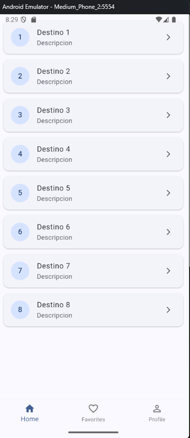
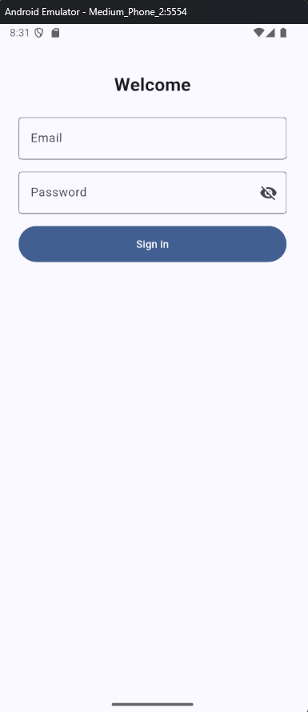
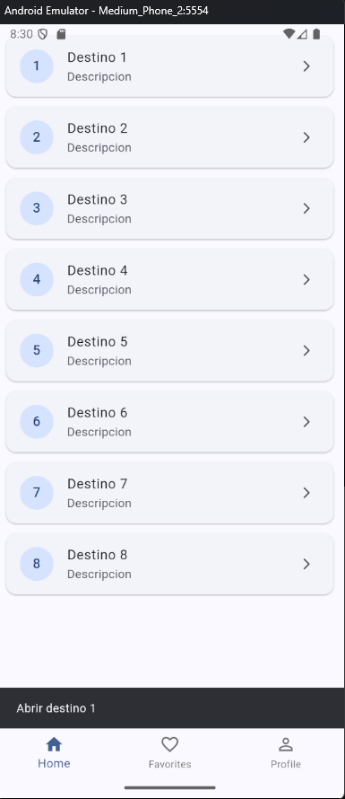
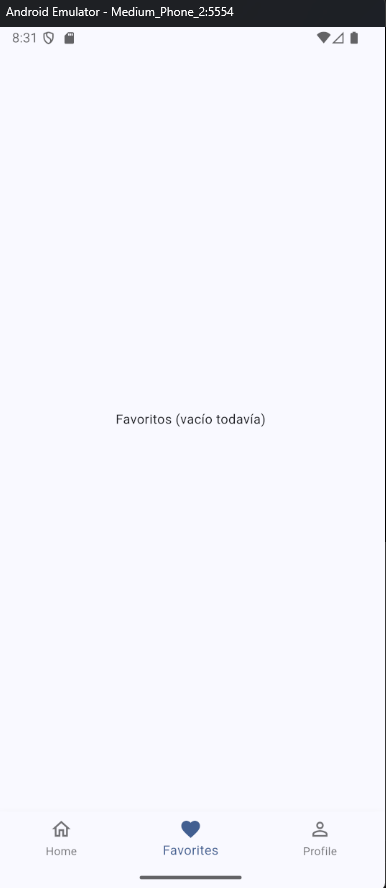

# Easy Travel

Aplicación Flutter desarrollada como proyecto base y mejorada con algunos cambios personales.  

Este proyecto fue refactorizado para mejorar la organización del código y la estructura de los widgets.

## Refactorización

Durante la refactorización se realizaron los siguientes ajustes principales:

- Separé los widgets en archivos individuales para que el código sea más limpio y fácil de mantener.  
- Renombré los archivos siguiendo una convención más clara (por ejemplo, `login_page.dart`, `home_page.dart`, etc.).  

## Capturas 

A continuación, algunas imágenes de la interfaz actual:

